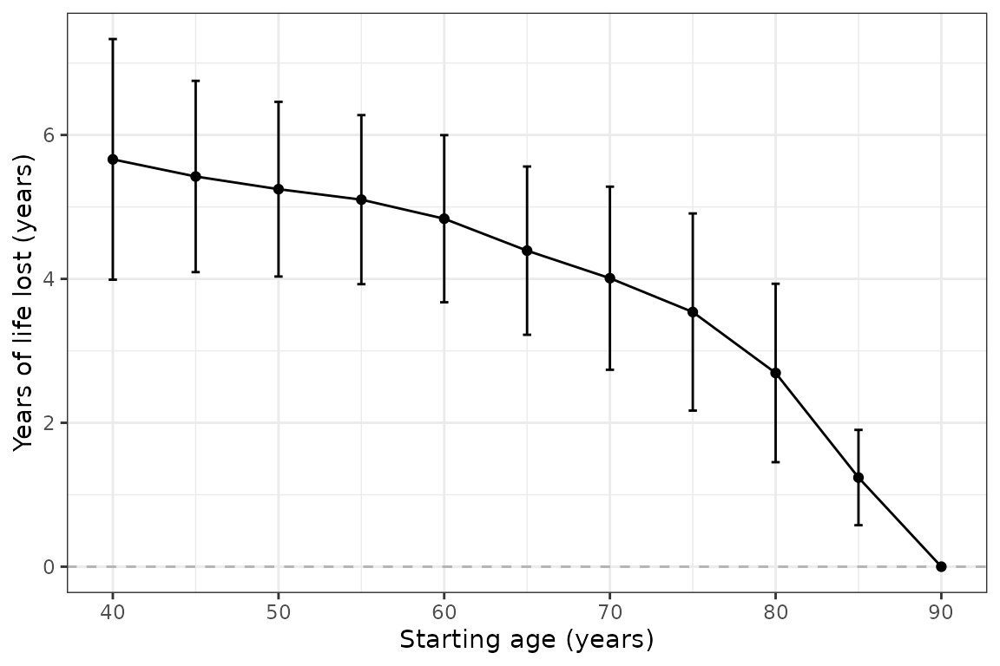
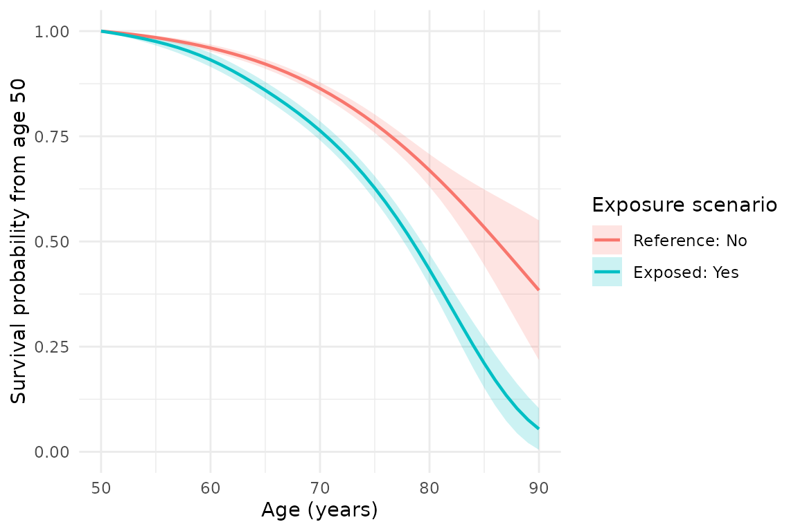

# estimandYLL 入門

`estimandYLL` は、2つの曝露シナリオの制限付き期待余命（ERL）の差を、
年単位の損失生存年数（YLL）として推定する R パッケージです。
差は常に「基準水準の ERL − 曝露水準の ERL」です。

## 対象集団と年齢を指定します

`target_population` は毎回指定します。`"all"` は全解析対象者、
`"exposed"` は観察時の曝露者、`"unexposed"` は観察時の非曝露者です。
モデルは全解析対象者で推定し、予測した生存曲線を平均する集団だけを変えます。

``` r

data(yll_toy)
previous_plan <- future::plan(future::multisession, workers = 2)
result <- estimate_yll(
  data = yll_toy,
  time_var = "period", event_var = "event",
  exposure_var = "hypertension",
  reference_level = "No", exposed_level = "Yes",
  age_at_entry_var = "age", target_population = "unexposed",
  age_start = 40, age_end = 90, age_interval = 5,
  confounders_baseline = c("sex", "education_years", "bmi", "smoke_binary"),
  B = 1000, seed = 20260917, ci_method = "normal", use_future = TRUE
)
future::plan(previous_plan)
```

この例では、合成データの5,000人全員を使い、高血圧のない人を対象集団とします。
ブートストラップは1,000回です。40歳から90歳まで、5歳刻みの開始年齢について、
90歳までの YLL と95%信頼区間を計算します。

上の計算は実行済みです。図を描くたびに1,000回の推定を繰り返す必要がないよう、
結果をパッケージに同梱しています。この入門記事の表と図も、次の保存済み結果から作っています。
[再実行用スクリプト](https://github.com/ShuntaroS/estimandYLL/tree/main/notes/published-example)
も公開しています。

``` r

result <- readRDS(system.file("extdata", "yll-example.rds", package = "estimandYLL"))
knitr::kable(result$summary, digits = 2)
```

| starting_age | erl_reference | erl_exposed |  yll | yll_se | ci_low | ci_high |
|-------------:|--------------:|------------:|-----:|-------:|-------:|--------:|
|           40 |         41.94 |       36.28 | 5.66 |   0.85 |   3.99 |    7.33 |
|           45 |         37.11 |       31.68 | 5.42 |   0.68 |   4.09 |    6.75 |
|           50 |         32.39 |       27.14 | 5.25 |   0.62 |   4.03 |    6.46 |
|           55 |         27.83 |       22.73 | 5.10 |   0.60 |   3.93 |    6.28 |
|           60 |         23.46 |       18.62 | 4.84 |   0.59 |   3.67 |    6.00 |
|           65 |         19.29 |       14.89 | 4.39 |   0.60 |   3.22 |    5.56 |
|           70 |         15.36 |       11.35 | 4.01 |   0.65 |   2.74 |    5.28 |
|           75 |         11.67 |        8.13 | 3.54 |   0.70 |   2.17 |    4.91 |
|           80 |          8.10 |        5.41 | 2.69 |   0.63 |   1.45 |    3.93 |
|           85 |          4.42 |        3.18 | 1.24 |   0.34 |   0.58 |    1.90 |
|           90 |          0.00 |        0.00 | 0.00 |   0.00 |   0.00 |    0.00 |

`age_interval`
は結果を表示する開始年齢の間隔であり、主推定法の計算は1年刻みです。
開始年齢が上限の90歳と同じなら、積分する区間がないため ERL と YLL
は0になります。

## 推定値を解釈します

曝露が生存を短くする場合、YLL は正になります。
曝露者を対象にした場合は、基準水準なら得られる年数と解釈します。
非曝露者を対象にした場合は、曝露水準なら失う年数と解釈します。
対象集団による符号の反転は行いません。負の推定値もそのまま返します。

`summary` は開始年齢ごとに1行です。`erl_reference` と `erl_exposed`
が両水準の ERL、`yll` がその差、`yll_se` が標準誤差、`ci_low` と
`ci_high` が信頼区間です。 上限年齢、対象集団、曝露水準などの共通設定は
`meta` にあります。

## 信頼区間と図を確認します

この公開例では `B = 1000` として個人単位のブートストラップを行いました。
`ci_method = "normal"` は 標準誤差を用いる正規近似、`"percentile"`
は反復推定値の分位点による区間です。
どちらも個人を復元抽出するノンパラメトリック・ブートストラップです。
区間は年齢ごとのもので、曲線全体を同時に覆う信頼帯ではありません。
`B = 0`
と指定すると点推定だけを計算するため、図にも信頼区間は表示されません。

``` r

if (requireNamespace("ggplot2", quietly = TRUE)) {
  print(plot_yll(result, conf_band = TRUE) + ggplot2::theme_bw())
  print(plot_survival(result, age_start = 50))
}
```



YLL の図は、5歳刻みの点推定と95%信頼区間をエラーバーで表示します。
生存曲線の図は、同じ1,000反復から求めた95%信頼区間を帯で表示します。

返り値は編集可能な `ggplot` オブジェクトです。`+ ggplot2::labs()`
でラベルを、 `+ ggplot2::theme()`
で外観を変更し、[`ggplot2::ggsave()`](https://ggplot2.tidyverse.org/reference/ggsave.html)
で保存できます。

``` r

ggplot2::ggsave("yll.png", plot_yll(result), width = 6, height = 4, dpi = 300)
```

## future による並列実行を使います

主関数
[`estimate_yll()`](https://shuntaros.github.io/estimandYLL/reference/estimate_yll.md)
は `use_future = TRUE` が既定です。 実際の並列化は、呼び出す側で指定した
[`future::plan()`](https://future.futureverse.org/reference/plan.html)
に従います。 上の例では `multisession` で2つの R
ワーカーを起動し、計算後に元の設定に戻しています。 `use_future = TRUE`
だけではワーカーは起動しません。 Poisson 法と Royston–Parmar
法の比較用関数は、現在は逐次実行です。

同じシードと同じ実行方式で繰り返した結果には再現性があります。 `future`
を使わない逐次実行と `future`
を使う実行とでは、乱数列が異なる場合があります。

## 解析時の前提を確認します

入力は1人1行で、選択した列の欠測は事前に明示的に処理してください。
各人の生存曲線を開始年齢で1に戻してから、対象集団で平均します。
その年齢で実際に観察された生存者だけを選ぶ推定ではありません。
曝露シナリオは持続的な曝露状態を表し、開始年齢で始める介入そのものではありません。

因果的な解釈には、交絡、曝露の重なり、打切り、コホート参加過程、モデルに関する
仮定が必要です。観察範囲外の年齢やデータの少ない組合せでは、モデルへの依存が強くなります。
反復の失敗は警告と `meta$bootstrap_failures` に記録されます。
失敗を多数含む信頼区間は、そのまま解釈しないでください。

`yll_toy`
は合成データです。この例は論文の実データによる結果の再現ではありません。
詳しい定義、比較手法、旧版からの移行方法は英語の解説記事を参照してください。
