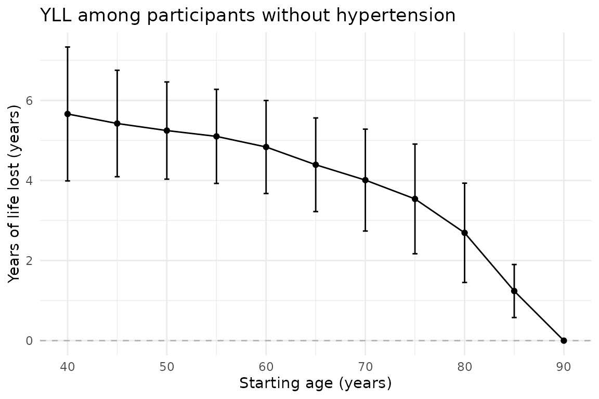
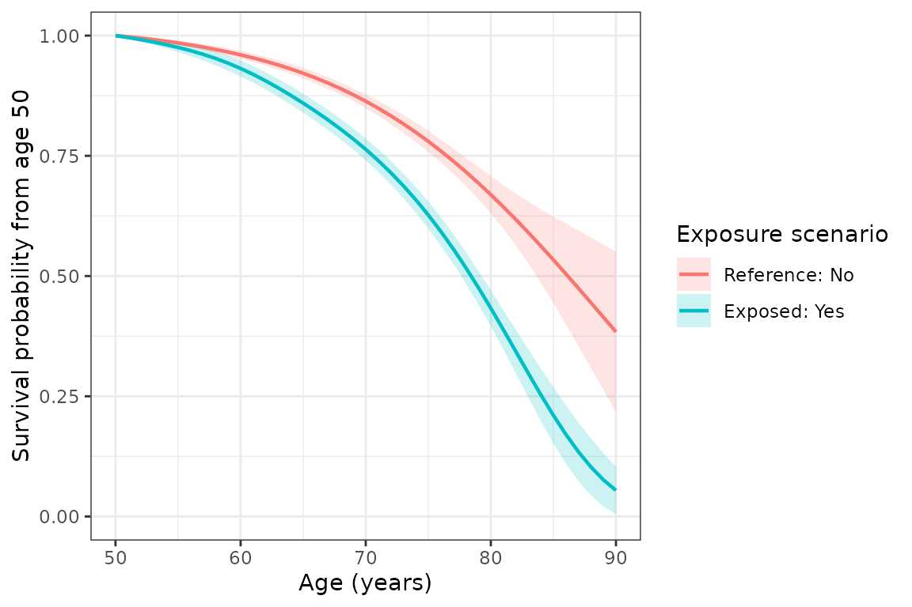

# Getting started with estimandYLL

The package estimates a difference in restricted expected residual
lifetime (ERL) between two exposure scenarios. State the target
population and the age window first. The fitted hazard model uses the
full analytic sample regardless of the target population.

## Prepare person-level data

Use one row per person, a unique ID, positive follow-up duration in
years, a 0/1 death indicator, age at entry, a binary exposure, and
baseline covariates. Missing values in selected variables are rejected.
Prepare a complete-case analysis explicitly and report how many people
were excluded. Data columns must have syntactically valid R names.

The included `yll_toy` data contain 5,000 simulated people. This example
uses the full dataset, 1,000 participant bootstrap replicates and
starting ages in five-year steps. The synthetic smoking variable
combines current and former smoking, so it should not be interpreted as
the paper’s current-versus-never smoking comparison.

``` r

data(yll_toy)
previous_plan <- future::plan(future::multisession, workers = 2)
result <- estimate_yll(
  data = yll_toy,
  time_var = "period", event_var = "event",
  exposure_var = "hypertension",
  reference_level = "No", exposed_level = "Yes",
  age_at_entry_var = "age", target_population = "unexposed",
  age_start = 40, age_end = 90, age_interval = 5,
  confounders_baseline = c("sex", "education_years", "bmi", "smoke_binary"),
  B = 1000, seed = 20260917, ci_method = "normal", use_future = TRUE
)
future::plan(previous_plan)
```

The bootstrap above has already been run. The complete saved result is
included with the package so that the figures can be reproduced without
refitting 1,000 models each time the documentation is built. The
[reproduction
script](https://github.com/ShuntaroS/estimandYLL/tree/main/notes/published-example)
records the settings and checks the saved result.

``` r

result <- readRDS(system.file("extdata", "yll-example.rds", package = "estimandYLL"))
knitr::kable(result$summary, digits = 2)
```

| starting_age | erl_reference | erl_exposed |  yll | yll_se | ci_low | ci_high |
|-------------:|--------------:|------------:|-----:|-------:|-------:|--------:|
|           40 |         41.94 |       36.28 | 5.66 |   0.85 |   3.99 |    7.33 |
|           45 |         37.11 |       31.68 | 5.42 |   0.68 |   4.09 |    6.75 |
|           50 |         32.39 |       27.14 | 5.25 |   0.62 |   4.03 |    6.46 |
|           55 |         27.83 |       22.73 | 5.10 |   0.60 |   3.93 |    6.28 |
|           60 |         23.46 |       18.62 | 4.84 |   0.59 |   3.67 |    6.00 |
|           65 |         19.29 |       14.89 | 4.39 |   0.60 |   3.22 |    5.56 |
|           70 |         15.36 |       11.35 | 4.01 |   0.65 |   2.74 |    5.28 |
|           75 |         11.67 |        8.13 | 3.54 |   0.70 |   2.17 |    4.91 |
|           80 |          8.10 |        5.41 | 2.69 |   0.63 |   1.45 |    3.93 |
|           85 |          4.42 |        3.18 | 1.24 |   0.34 |   0.58 |    1.90 |
|           90 |          0.00 |        0.00 | 0.00 |   0.00 |   0.00 |    0.00 |

Here the target is people observed without hypertension. The estimate at
age 50 compares expected years lived between ages 50 and 90 under the
reference and exposed scenarios, averaged over those people’s baseline
covariates. `age_interval = 5` reports ages 40, 45, …, 90; the
calculation uses annual hazards. All lifetimes and YLL are zero at age
90 because the age window is empty.

## Request confidence intervals

Both options use a nonparametric participant bootstrap. Each replicate
refits the model, including spline knot selection, and repeats
prediction and standardization. The default normal interval is the point
estimate plus or minus a normal quantile times the bootstrap standard
error. The percentile interval takes quantiles of the replicate
estimates.

The published example uses `ci_method = "normal"` and
`conf_level = 0.95`. To request percentile intervals, set
`ci_method = "percentile"` in the estimation call. With `B = 0`, no
bootstrap is run and no confidence intervals are drawn.

The 1,000-replicate fit is not rerun during package checks. Failed
replicates produce a warning and are recorded with iteration numbers and
reasons in `result$meta$bootstrap_failures`. Intervals use the
successful replicates; many failures undermine their interpretation. Do
not treat a computed interval as evidence that the model was stable.

## Inspect and customize plots

``` r

if (requireNamespace("ggplot2", quietly = TRUE)) {
  print(plot_yll(result, conf_band = TRUE) +
          ggplot2::labs(title = "YLL among participants without hypertension"))
  print(plot_survival(result, age_start = 50) + ggplot2::theme_bw())
}
```



``` r

ggplot2::ggsave("yll.png", plot_yll(result), width = 6, height = 4, dpi = 300)
```

The YLL figure shows points and error bars at five-year starting-age
intervals. The error bars are 95% pointwise confidence intervals from
the 1,000 replicates. The survival figure uses the same replicates to
display shaded pointwise intervals. Survival bands use the selected
interval method and are clipped to zero and one. They are not
simultaneous confidence bands across ages.

## Inspect the complete result

`summary` contains one row per starting age. `bootstrap_estimates` adds
an `iteration` column to replicate estimates. `survival_curves` contains
`starting_age`, `age`, `survival_reference`, and `survival_exposed`;
`bootstrap_survival_curves` adds `iteration`. `meta` records settings,
population sizes, successful replicate count, and failures.

## Optional parallel bootstrap

``` r

previous_plan <- future::plan(future::multisession, workers = 2)
# Use use_future = TRUE in estimate_yll().
future::plan(previous_plan)
```

[`estimate_yll()`](https://shuntaros.github.io/estimandYLL/reference/estimate_yll.md)
defaults to `use_future = TRUE`, which uses the caller’s future plan. A
sequential plan still runs sequentially; a multisession plan starts
separate R workers. The Poisson and Royston-Parmar comparators currently
run sequentially.

The package uses the caller’s future plan and progressr handlers. It
does not start a worker pool or change global progress handlers. Random
state is restored after estimation. Repeating a call with the same seed
and backend is reproducible; sequential and future backends can use
different random streams.
